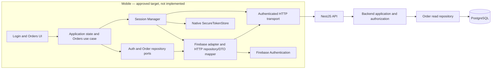

# ADR-025 — Mobile ↔ Backend Integration

- **Status:** Accepted architecture decision; M8-B.1 session foundation is implemented on a feature branch and awaiting review; Firebase provider integration, Orders read integration, and end-to-end acceptance remain unimplemented
- **Date:** 2026-10-09
- **Scope:** First online mobile integration slice: authentication/session establishment and authenticated canonical Order reads on Android
- **Related:** [ADR-018](ADR-018-production-backend-foundation.md), [ADR-019](ADR-019-identity-authentication-foundation.md), [ADR-020](ADR-020-authorization-foundation.md), [ADR-021](ADR-021-canonical-order-creation-and-optional-scheduling.md), [ADR-022](ADR-022-order-retrieval-read-path.md), [ADR-023](ADR-023-cleaning-execution-lifecycle.md), [ADR-024](ADR-024-cleaning-scheduling-and-calendar-coordination.md), [Architecture Map](ARCHITECTURE_MAP.md), [Roadmap](ROADMAP.md)

## Context

The mobile application currently uses its development composition and in-memory HTTP handlers. It does not authenticate with Firebase or call the production backend. The backend already implements Firebase identity-proof verification, Qleanfeel session credentials, and owner-scoped `GET /v1/me/orders` backed by PostgreSQL. M7 implementation status does not imply that the backend is deployed or that the mobile application is integrated.

M8 is Mobile ↔ Backend Integration. Reports are deferred and are not M8 scope. This ADR records the approved integration boundary and the first end-to-end acceptance path; it does not authorize implementation by itself.

## Decision

### First vertical slice and boundaries

The first product path is:

```text
Firebase identity proof
  → Qleanfeel session bootstrap/refresh
  → authenticated GET /v1/me/orders
  → NestJS application and owner-scoped read repository
  → PostgreSQL
  → canonical mobile Order model
  → Android Orders UI
```

The accepted end-to-end path uses real HTTP and PostgreSQL-backed backend behavior. It must not use `createDevelopmentHttpFetch` or in-memory backend data.



UI and application state do not hold access or refresh credentials. Firebase SDK types remain inside the provider adapter. Mobile repository ports and domain models remain independent of Firebase, React Native, NestJS, HTTP, and PostgreSQL.

### Authentication and session lifecycle

Firebase Phone Authentication is the preferred provider candidate, pending verification of the Firebase project, Android configuration, SMS-region availability, consent, and operational prerequisites. This decision does not assert that a Firebase project or Android Firebase configuration currently exists. Firebase proves external identity at bootstrap; the Qleanfeel backend remains authoritative for the internal User, session, account status, and protected API access. The backend issues Qleanfeel access and refresh credentials. Future providers must fit the provider adapter and backend identity-proof boundary without changing Qleanfeel domain concepts.

A dedicated application-level `SessionManager` owns bootstrap, startup restoration, refresh coordination, logout, and the in-memory access credential. `AuthStateController` exposes only safe application state such as user identity and authentication status. Access tokens remain in memory where practical and are never placed in business entities or unnecessary UI state.

Refresh tokens are stored only through a native secure-storage adapter. `react-native-keychain` is the preferred candidate, subject to a compatibility build/device check against the repository's React Native version, Android configuration, and New Architecture. The selected library and its backup/device-reset behavior must be verified before implementation is considered complete.

The authenticated request path coordinates concurrent `401` responses through one in-flight refresh. After a successful refresh, each original protected request may be retried at most once. Do not refresh automatically for `403`, validation errors, `5xx` responses, or network failures. Logout clears local credentials and session state even if the backend cannot be reached; server-side revocation is reported as successful only when confirmed.

### Refresh rotation limitation

The backend rotates refresh tokens, rejects reuse of a consumed token, and does not implement token-family recovery. If rotation commits but its response is lost, the client may not have the replacement credential and may need to authenticate again. The client must not blindly replay an ambiguous refresh request. A rejected old token does not provide a recovery path; the previous server session may remain active until its expiry when the client cannot revoke it. M8 does not change the backend refresh protocol or invent recovery. Any recovery protocol requires a separate explicit architecture decision.

### Canonical Orders contract and manual-order capability

The mobile read model follows `Order → 0..N Cleaning → 0..1 current CalendarEntry per Cleaning`. The authenticated collection contract is `GET /v1/me/orders?limit&cursor`, returning `{ items, nextCursor }`. The API DTO is mapped into provider-independent mobile models; the obsolete `/v1/me/manual-orders` development contract is not used for the accepted production read path.

`manual`, `qleanfeel`, and `client` describe origins of the same canonical Order model. Manual order creation remains a first-class business capability and must not be removed, weakened, or redefined by this read integration. Later mobile write integration uses the canonical Orders API and its authorization rules; it does not revive the obsolete ManualOrder endpoint or model as a separate production business entity.

### Online behavior and safe errors

The first slice is online-only; it adds no offline synchronization or full offline cache. Orders UI behavior covers loading, success, empty results, network failure, server failure, and expired or revoked sessions. Error mapping uses safe categories and does not show credentials, raw sensitive response details, or provider/server internals to users.

### Test environment and acceptance

The real Android → HTTP → NestJS → PostgreSQL → Android path is required before the first vertical slice is declared complete. It uses isolated test infrastructure and test identities. PostgreSQL is never exposed publicly. A shared test endpoint requires HTTPS and appropriate network restrictions. VPS existence does not establish configured DNS, HTTPS, firewall rules, deployment, or database isolation; those are environment prerequisites to verify with the project owner.

Acceptance requires evidence that:

1. A configured Firebase test identity establishes a Qleanfeel session through the real bootstrap contract.
2. The refresh credential is persisted only in native secure storage and restores a Qleanfeel session; access tokens do not enter business models or UI state.
3. Android issues a real authenticated `GET /v1/me/orders` request, and the registered NestJS route reads PostgreSQL-backed data.
4. The Android UI renders the canonical Order response, including zero or multiple Cleanings and each Cleaning's optional CalendarEntry.
5. Owner isolation is verified: one user's session cannot read another user's Orders.
6. Loading, success, empty, network, server, and expired/revoked-session behavior is exercised without leaking credentials or sensitive error details.
7. Concurrent protected requests share one refresh; an original request is retried no more than once after successful refresh.
8. The accepted path does not use the development fake HTTP fetch or in-memory persistence.
9. Manual order creation remains a first-class capability and is not replaced by a separate canonical ManualOrder model.

### Proposed implementation sequence

The following labels are provisional and describe future work, not completed or started implementation:

| Proposed slice                     | Objective                                                                                                | Gate                                                                                                  |
| ---------------------------------- | -------------------------------------------------------------------------------------------------------- | ----------------------------------------------------------------------------------------------------- |
| **M8-B — Session Foundation**      | Firebase provider adapter, native secure token storage, Session Manager, and authenticated HTTP behavior | Firebase prerequisites and secure-store compatibility are verified; session/error/refresh tests pass. |
| **M8-C — Orders Read Integration** | Canonical DTO mapping, repository integration, and Orders UI states                                      | Real API contract mapping, empty/error behavior, and owner-scoped response handling are covered.      |
| **M8-D — End-to-End Acceptance**   | Real Android, HTTP, backend, PostgreSQL, ownership isolation, and failure-path verification              | The complete acceptance path above is demonstrated in an isolated environment.                        |

Environment preparation may be a prerequisite for M8-D; it is not assigned a milestone number here.

### M8-B.1 implementation status

The M8-B.1 feature branch adds a provider-independent `SessionManager`, a `SessionApi` port and HTTP adapter for bootstrap/refresh/logout, a `SecureTokenStore` port and Keychain adapter, and bounded 401 refresh/retry coordination in `HttpTransport`. The refresh token is persisted before a session is made available; access credentials remain in memory. Failed or ambiguous refresh outcomes clear usable local credentials and require authentication again. Local logout blocks protected access and clears secure storage before best-effort server revocation; the caller can distinguish confirmed revocation from an unconfirmed attempt.

This implementation is not yet merged. It does not add a Firebase mobile SDK/adapter, select a backend base URL, or activate a production composition. `App.tsx` continues to use the explicit development composition; its OTP and business HTTP behavior remain fake/in-memory. The Keychain spike provides one-device build/runtime evidence, not universal device coverage or confirmation of backup, reset, and key-invalidation behavior. M8-B remains incomplete until its remaining provider/environment gates are addressed. No Orders screen, Orders API, or real Android-to-backend-to-PostgreSQL path is implemented by M8-B.1.

Local verification on the feature branch: TypeScript typecheck and the full Jest suite passed (34 suites, 303 tests). GitHub CI and merge status are tracked by the feature PR, not inferred here.

## Non-goals

M8 does not add offline synchronization or a full cache, a Calendar CRUD API, generic API idempotency, refresh-token recovery, production deployment/operations, production signing, Reports, or unrelated product domains. It does not alter backend API contracts or claim that Firebase/VPS configuration exists. It preserves the existing manual-order capability and the M7 canonical Order model.
