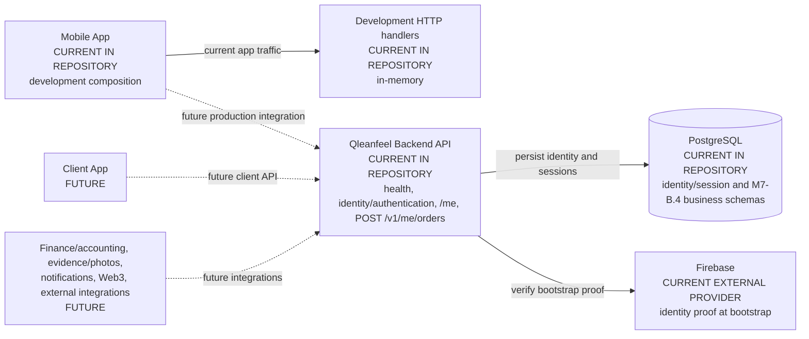
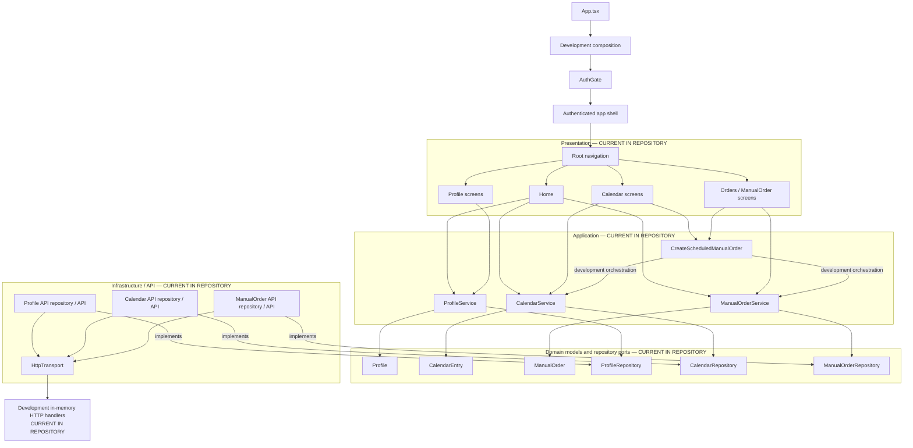
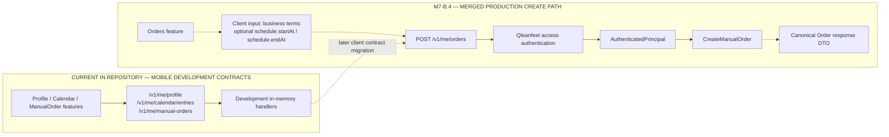
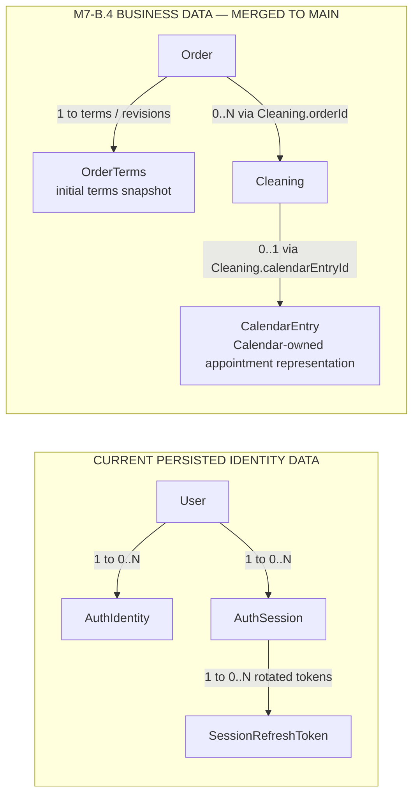
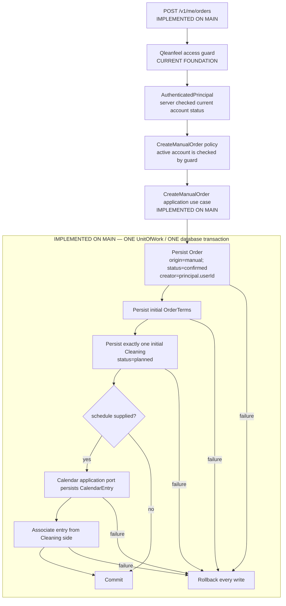

# Qleanfeel Living Architecture Map

This document is a visual guide to the repository architecture. It distinguishes code currently present in `main`, M7-B.5 work on its feature branch, and later product ideas. “Current” does not claim that a component is deployed.

The map does not replace architectural decisions or milestone status. See [ADRs](DECISIONS.md) for decisions and [ROADMAP.md](ROADMAP.md) for milestone status. `main` contains M7-B.1–B.4; M7-B.5 is implemented on its Draft PR feature branch and is not merged.

## 1. System Context



The mobile app currently uses its development composition; its API-shaped calls do not reach the backend. The backend Firebase verifier is an identity-proof adapter. Protected API requests use Qleanfeel-issued credentials, not Firebase credentials.

## 2. Mobile Feature Map



The folders represent the current mobile boundaries: `src/presentation`, `src/application`, `src/domain`, `src/infrastructure`, and `src/development`. Home composes Profile, Calendar, and ManualOrder reads. The current scheduled-order coordinator makes separate Calendar and ManualOrder calls and uses best-effort compensation; it is not the planned backend transaction.

## 3. Mobile ↔ Backend Boundary



For the create request, client-controlled business intent includes customer/service terms and an optional `schedule` containing `startAt` and `endAt`. Those are requested appointment times, not server-authored metadata. The server derives identity and security facts: `createdByUserId` from `AuthenticatedPrincipal.userId`, `origin=manual`, generated IDs, `createdAt`, `updatedAt`, event-recording timestamps, version, lifecycle status, and any assignment/ownership fact. The client cannot assert those values.

The initial Cleaning assignment, if present in this slice, is derived from the same principal. No separate account role, `isCleaner` flag, or capability source is implied. The response is a canonical Order API DTO; it must not expose persistence rows or internal domain objects. Exact DTO fields remain in the B4 API implementation contract, not in this map.

## 4. Backend Module Map

```mermaid
flowchart TB
  subgraph Http["HTTP / NestJS — CURRENT IN REPOSITORY"]
    IdentityHTTP["Identity HTTP<br/>bootstrap, refresh, logout, /me"]
    OrdersHTTP["Orders HTTP<br/>POST, GET /v1/me/orders — main<br/>GET /v1/me/orders/:id — M7-B.5 Draft PR"]
    Health["Health"]
  end

  subgraph Application["Application — CURRENT FOUNDATION"]
    IdentityUC["Identity use cases"]
    OrdersUC["CreateManualOrder — main<br/>ListMyOrders / GetMyOrder — M7-B.5 Draft PR"]
    AuthZ["Authorization decision, denial,<br/>resource-policy boundary"]
    Ports["Repository, credential, verifier,<br/>clock, ID, UnitOfWork ports"]
  end

  subgraph Domain["Domain — CURRENT IN REPOSITORY"]
    IdentityDomain["User, AuthIdentity,<br/>AuthSession, refresh-token concepts"]
    BusinessDomain["Order, OrderTerms,<br/>Cleaning, CalendarEntry — main"]
  end

  subgraph Infrastructure["Infrastructure — CURRENT IN REPOSITORY"]
    FirebaseAdapter["Firebase identity-proof verifier"]
    CredentialAdapters["Qleanfeel access / refresh adapters"]
    PostgresAdapters["PostgreSQL identity repositories<br/>and UnitOfWork"]
    BusinessAdapters["PostgreSQL business write + read adapters<br/>write path — main; read path — M7-B.5 Draft PR"]
  end

  DB[("PostgreSQL identity/session and<br/>Order/Cleaning/Calendar schema")]
  IdentityHTTP --> IdentityUC
  OrdersHTTP --> OrdersUC
  OrdersUC --> BusinessDomain
  OrdersUC --> AuthZ
  OrdersUC --> Ports
  IdentityUC --> IdentityDomain
  IdentityUC --> Ports
  FirebaseAdapter -->|"implements verifier port"| Ports
  CredentialAdapters -->|"implement credential ports"| Ports
  PostgresAdapters -->|"implement repository / UoW ports"| Ports
  BusinessAdapters -->|"implement business repository ports"| Ports
  PostgresAdapters --> DB
  BusinessAdapters --> DB

  Orders["Orders create command — main"]
  Cleaning["Initial Cleaning persistence — main"]
  Calendar["Calendar scheduling port — main<br/>no full Calendar API"]
  Profile["Profile backend — FUTURE"]
  Orders -.-> Application
  Cleaning -.-> Application
  Calendar -.-> Application
  Profile -.-> Application
```



Authorization is Application code, not a separate NestJS module. The policy does not load resources, use infrastructure, or manage transactions. M7-B.4 introduces its operation-specific policy with the first business use case; other business modules remain future work.

## 5. Business Data Model



`Order → 0..N Cleaning` is the global relationship. The `CreateManualOrder` command creates exactly one initial Cleaning. `CalendarEntry` is Calendar-owned and represents a planned appointment; it has no direct Order or Cleaning reference. Calendar completion does not mean that Cleaning was performed. Cleaning remains the source of work-execution truth.

The diagram omits future customer, finance, evidence, event-history, and capability-management models. They are not introduced by M7-B.4 or M7-B.5.

## 6. Atomic CreateManualOrder Flow



All listed writes and the Cleaning-to-CalendarEntry relation use the same UnitOfWork context. Calendar does not open a separate transaction. There is no nested UnitOfWork, best-effort compensation, or partial persistence. If the optional requested schedule cannot be created, the whole command rolls back. No Calendar CRUD/read/list API is part of B4.

M7-B.4 does not provide generic API idempotency. A client retry after a lost response can create a duplicate; this risk is explicitly deferred to a future API reliability slice.

## 7. Authentication Flow

```mermaid
sequenceDiagram
  participant Client as Credential-holding client
  participant API as Qleanfeel API
  participant Firebase as Firebase proof verifier/provider
  participant DB as PostgreSQL
  participant App as Application use case

  Client->>API: POST /v1/auth/bootstrap with Firebase identity proof
  API->>Firebase: Verify identity proof
  Firebase-->>API: Normalized provider and subject
  API->>DB: Resolve User/AuthIdentity; create AuthSession and refresh-token hash
  API-->>Client: Qleanfeel access and refresh credentials
  Client->>API: Protected request with Qleanfeel access credential
  API->>DB: Validate current User and AuthSession
  API->>App: AuthenticatedPrincipal(userId, sessionId)
```

This backend flow is implemented in the repository. The current mobile app still uses development authentication and is not connected to it. Firebase proves identity during bootstrap; protected API requests use Qleanfeel credentials and a server-resolved principal.

## 8. Legend, Status Semantics, and Sources

| Notation | Meaning |
| --- | --- |
| `CURRENT IN REPOSITORY` | Implemented on `main`; this does not assert deployment. |
| `IMPLEMENTED ON MAIN` | Implemented and merged to `main`; this does not assert deployment. |
| `M7-B.5 DRAFT PR` | Implemented on the M7-B.5 feature branch, not yet merged to `main`. |
| `PLANNED` | Approved or proposed work not implemented in the current slice. |
| `FUTURE` | Outside M7-B.4/B.5 and not implemented. |
| Solid arrow | The call, dependency, or data flow shown; status comes from the node or containing boundary. |
| Dashed arrow | Planned or future interaction/data flow. |
| Subgraph | Architectural or ownership boundary. |
| Database cylinder | Persisted state. |
| UnitOfWork boundary | One transaction; enclosed writes commit or roll back together. |

Architectural decisions remain in [ADR-011 — Calendar](ADR-011-calendar.md), [ADR-012 — ManualOrder compatibility](ADR-012-manual-orders.md), [ADR-014 — Canonical Order and work execution](ADR-014-canonical-order-and-work-execution.md), [ADR-018 — Production Backend Foundation](ADR-018-production-backend-foundation.md), [ADR-019 — Identity and Authentication](ADR-019-identity-authentication-foundation.md), [ADR-020 — Authorization Foundation](ADR-020-authorization-foundation.md), and [ADR-021 — M7-B.4 Order creation](ADR-021-canonical-order-creation-and-optional-scheduling.md). The [M6 proposal](M6_ARCHITECTURE_PROPOSAL.md) and [M7 proposal](M7_ARCHITECTURE_PROPOSAL.md) provide broader context. Milestone status remains in [ROADMAP.md](ROADMAP.md).

Update this map alongside a milestone decision when module ownership, an API boundary, persistence, or a transaction boundary changes. Keep detailed rules in ADRs and milestone progress in the roadmap; do not copy those details here.
